## 6D Object Pose Estimation for Robotic Grasping

## Project Summary:

This project implements and validates a complete, end-to-end deep learning pipeline to predict the 6D pose (3D rotation and 3D translation) of known objects from a single RGB image. The system leverages a transfer learning approach with a ResNet50 backbone to perform this complex regression task.

The primary goal was to build a robust, script-based application that mimics a real-world computer vision task for robotic automation, such as identifying an object's precise orientation and position for a robotic arm to grasp it from a cluttered bin. This project showcases a full range of ML engineering skills, from managing complex data and environments to training, evaluating, and packaging a deep learning model.

## Model Architecture:

The core of this project is a custom PoseNet model built using PyTorch. The architecture is designed to leverage the power of transfer learning for efficient and effective feature extraction.

**Backbone:** A pre-trained ResNet50 model (trained on ImageNet) is used as the feature extraction backbone. The final classification layer of the ResNet50 is removed, allowing the model to output a rich 2048-dimensional feature vector for any given input image.

**Custom Regression Head:** A custom head is attached to the ResNet50 backbone. This head consists of several fully-connected layers with ReLU activations and Dropout for regularization. Its purpose is to take the high-level features from the backbone and regress them into pose information.

**Dual Outputs:** The head splits into two final output layers to predict the two components of the 6D pose:

1. Translation: A linear layer that outputs 3 continuous values representing the object's (x, y, z) position.

2. Rotation: A linear layer that outputs 6 continuous values representing the object's orientation in a 6D continuous representation. This format is more stable for deep learning compared to quaternions or Euler angles and is converted back to a standard 3x3 rotation matrix during evaluation.

## Key Results:

After being trained for 20 epochs on the YCB-Video dataset, the model successfully learned to predict object poses. The final validation loss (Mean Squared Error) demonstrates the model's predictive accuracy.

Final Validation Loss (Translation MSE): [Enter Your Final Translation Loss Here]

Final Validation Loss (Rotation MSE): [Enter Your Final Rotation Loss Here]

Below is a qualitative result from the evaluation script, showing the model's prediction (Red Lining) overlaid against the ground truth (Green Lining).


## Tech Stack:

**Model Development**: PyTorch, Torchvision

**Data Science & ML**: Scikit-learn, NumPy, OpenCV, Open3D

**Environment & MLOps**: Conda, Git, Git LFS

**Utilities**: TQDM, Matplotlib

## Project Structure:

```
├── datasets/           # (Populated by scripts) Holds the YCB-Video dataset.
├── src/
│   ├── components/
│   │   ├── data_ingestion.py
│   │   ├── dataset.py
│   │   └── model_trainer.py
│   ├── utils.py
│   └── ... (logger, exception handling)
├── train.py            # Script to train the model.
├── evaluate.py         # Script to evaluate the trained model.
├── prepare_split.py    # Script to create a local validation set.
├── requirements.txt    # Project dependencies.
├── setup.py            # Makes the project an installable package.
└── README.md
```

## Setup and Usage:

1. Clone the repository:

```
git clone https://github.com/vidyacheekuri/Robotic_Item_Picking.git
cd Robotic_Item_Picking
```

2. Create and activate the Conda environment:
This project requires Conda to manage the complex dependencies, particularly Open3D on macOS.

```
conda create --name robotics_env python=3.8
conda activate robotics_env
conda install -c open3d-admin open3d
pip install -r requirements.txt
```

3. Data Preparation:
The YCB-Video dataset is required. Due to the instability of public download links, the recommended approach is to acquire the models.zip and data.zip files from the official sources and place them in a datasets/ directory.

4. Train a new model:
This script will train the model for a specified number of epochs and save the weights as posenet_model.pth.
```
python train.py
```
5. Evaluate the pre-trained model:
To run the evaluation, you must have a posenet_model.pth file and a validation_data/ folder (which can be created using prepare_split.py).
```
python evaluate.py
```
## Key Challenges & Learnings:

Environment Instability: A significant challenge was overcoming deep library conflicts (Open3D, PyTorch) and persistent memory crashes (segmentation faults) on a local macOS environment. This was solved by systematically debugging the library stack and transitioning to a robust, script-based workflow in a clean, reproducible Conda environment. This experience was a practical lesson in the importance of stable MLOps practices.

Data Unavailability: The project was frequently blocked by broken and unreliable public links to the large YCB-Video dataset. This real-world issue was navigated by systematically finding and testing alternative data sources and workflows, including the Kaggle API and direct programmatic downloads from university archives. This highlighted the necessity of data pipeline resilience.

Large File Management: The trained model exceeded GitHub's 100 MB file limit, necessitating the implementation of Git LFS for proper version control of large model artifacts. This provided hands-on experience with standard industry practices for managing large-scale ML projects.

This project was a deep dive into the practical realities of building and deploying a complex machine learning system, emphasizing perseverance and pragmatic problem-solving.

```mermaid
graph LR
    subgraph "1. Data Preparation"
        A["🖼️ YCB-Video Dataset"] --> B{"Data Ingestion & Preprocessing"};
        B --> C["PyTorch DataLoader"];
    end

    subgraph "2. Model Training Loop"
        D["PoseNet Model (ResNet50 Backbone)"];
        F["Loss Calculation (MSE)"];
        G["Adam Optimizer"];
    end
    
    subgraph "3. Evaluation"
        H["✅ Trained posenet_model.pth"];
        I{"Inference"};
        J["Validation Image"];
        K["Predicted 6D Pose"];
        M{"Visualization"};
        N["Final Result Image"];
    end

    %% --- Define the connections to enforce order ---
    C --> D;
    D -- "Predictions" --> F;
    C -- "Ground Truth Poses" --> F;
    F --> G;
    G --> D;
    G --> H;
    H --> I;
    J --> I;
    I --> K;
    K -.-> M;
    M --> N;


    style A fill:#f9f,stroke:#333,stroke-width:2px
    style D fill:#bbf,stroke:#333,stroke-width:2px
    style H fill:#c9c,stroke:#333,stroke-width:2px
    style N fill:#9c9,stroke:#333,stroke-width:2px

```

